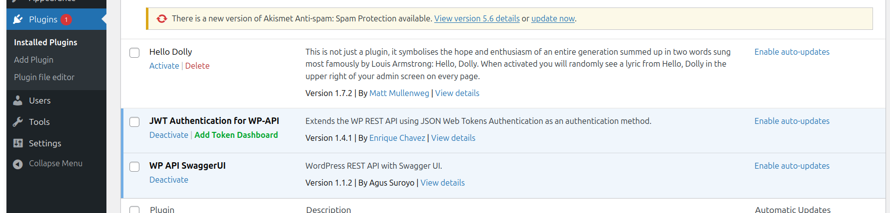
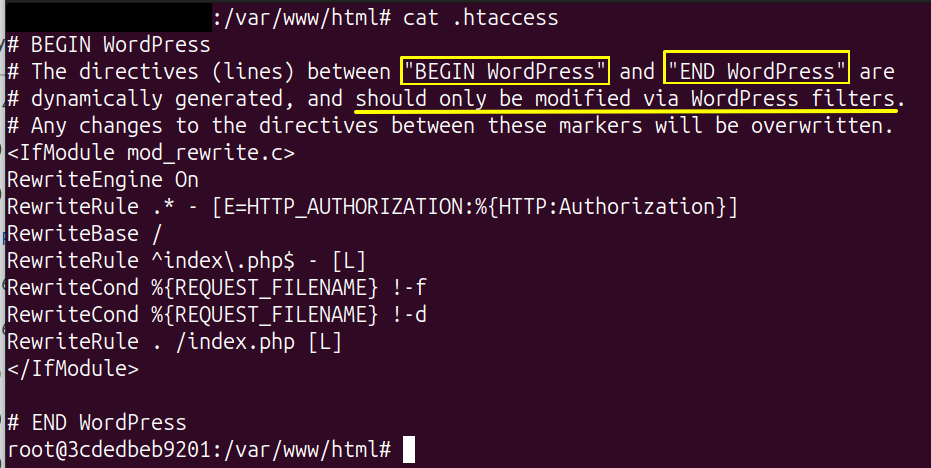
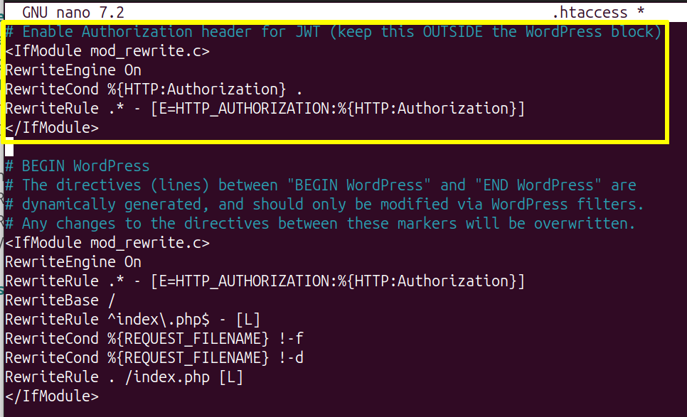
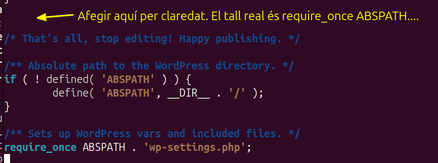

# Guia pas a pas: API REST de WordPress amb JWT (Docker)

Aquesta guia explica com configurar i utilitzar la **API REST de WordPress** amb **autenticació JWT**, en un entorn **local amb Docker**, accessible des de la xarxa local, i consumida des d’un **PC diferent** mitjançant **JavaScript**.

---

## Escenari

- WordPress en servidor local instal·lat amb Docker  
- Accés al WordPress per IP des de qualsevol PC de la LAN  
- Creació d’usuari **admin** i **editor**  
- Autenticació de la REST API mitjançant **JWT**  
- Exemple de **GET** i **POST** amb JavaScript des d’un altre PC  

---

## 1. Prerequisits i esquema

- Servidor (Linux / Windows / Mac) amb **Docker** i **Docker Compose**
- IP del servidor a la LAN (exemple: `192.168.1.50`)
- WordPress accessible a: `http://192.168.1.50:8080`
- PC client a la mateixa xarxa (amb navegador i Python opcional)

---

## 2. Docker Compose: WordPress + MariaDB

Crea una carpeta `wp-lan/` i dins un fitxer `docker-compose.yml`:

```yaml
services:
  db:
    image: mariadb:11
    container_name: wp_db
    restart: unless-stopped
    environment:
      MARIADB_DATABASE: wordpress
      MARIADB_USER: wpuser
      MARIADB_PASSWORD: wp_pass_123
      MARIADB_ROOT_PASSWORD: root_pass_123
    volumes:
      - db_data:/var/lib/mysql

  wordpress:
    image: wordpress:latest
    container_name: wp_app
    restart: unless-stopped
    depends_on:
      - db
    ports:
      - "8080:80"
    environment:
      WORDPRESS_DB_HOST: db:3306
      WORDPRESS_DB_NAME: wordpress
      WORDPRESS_DB_USER: wpuser
      WORDPRESS_DB_PASSWORD: wp_pass_123
    volumes:
      - wp_data:/var/www/html

volumes:
  db_data:
  wp_data:
```

Arrenca els contenidors:

```bash
docker compose up -d
```

Comprova des d’un altre PC:

```
http://192.168.1.50:8080
```

---

## 3. Configurar WordPress per IP

A l’admin (`/wp-admin`):

**Settings → General**

- WordPress Address: `http://192.168.1.50:8080`
- Site Address: `http://192.168.1.50:8080`

Desa els canvis.

---

## 4. Crear usuaris

### 4.1 Admin
Creat durant la instal·lació.

### 4.2 Editor
- Users → Add New
- Usuari: `editor1`
- Rol: **Editor**

---

## 5. Activar JWT per la REST API

Instal·la el plugin:

**JWT Authentication for WP REST API** [(tmeister)](https://es.wordpress.org/plugins/jwt-authentication-for-wp-rest-api/?utm_source=chatgpt.com)


Plugins → Add New → cerca `jwt-authentication-for-wp-rest-api` → Install → Activate



---

## 6. Configurar JWT i Apache

### Accedir al contenidor
```bash
docker exec -it wp_app bash
apt update && apt install -y nano
```

### 6.1 Habilitar Authorization header (.htaccess)

Editar `/var/www/html/.htaccess` i afegir **fora i aband del bloc WordPress**:

```apache
<IfModule mod_rewrite.c>
RewriteEngine On
RewriteCond %{HTTP:Authorization} .
RewriteRule .* - [E=HTTP_AUTHORIZATION:%{HTTP:Authorization}]
</IfModule>
```




### 6.2 Afegir JWT secret i CORS

Edita `wp-config.php` **abans de la línia /* That's all, stop editing! Happy publishing. */**:

```php
define('JWT_AUTH_SECRET_KEY', 'posa_aqui_una_clau_llarga_i_unica');
define('JWT_AUTH_CORS_ENABLE', true);
```

En realitat és abans que : que carregui `wp-settings.php`, ja que a partir d’ahi: WordPress s’inicialitza, carrega plugins, llegeix configuració i
arrenca la REST API



---

## 7. Notes sobre CORS

- No obrir els HTML amb `file://`
- Cal servir-los amb un servidor web local

---

## 8. Provar endpoints bàsics

### Públic
```
GET /wp-json/wp/v2/posts
```

### JWT
```
POST /wp-json/jwt-auth/v1/token
POST /wp-json/jwt-auth/v1/token/validate
```

```
curl -X POST "https://IP_del_WP/wp-json/jwt-auth/v1/token" \
-H "Content-Type: application/json" \
-d '{"username":"usuari_editor","password":"pass_user_editor"}'
```

---

## 9. Exemple GET amb HTML + JavaScript

Fitxer `get-posts.html` (PC client):

```html
<!doctype html>
<html lang="ca">
<head>
  <meta charset="utf-8" />
  <title>WP REST - GET Posts</title>
</head>
<body>
  <h1>GET Posts</h1>
  <button id="btn">Carrega posts</button>
  <pre id="out"></pre>

  <script>
    const WP_BASE = "http://192.168.1.50:8080";

    document.getElementById("btn").onclick = async () => {
      const r = await fetch(`${WP_BASE}/wp-json/wp/v2/posts`);
      const data = await r.json();
      document.getElementById("out").textContent =
        JSON.stringify(data, null, 2);
    };
  </script>
</body>
</html>
```

---

## 10. Exemple Login + POST amb JWT

Fitxer `login-and-post.html`:

```html
<!-- Codi complet idèntic al de la guia original -->
```

(veure repositori per versió completa)

---

## 11. Servir els HTML

```bash
python -m http.server 5500
```

Obrir:

- `http://IP_CLIENT:5500/get-posts.html`
- `http://IP_CLIENT:5500/login-and-post.html`

---

## 12. Troubleshooting

- **No connecta:** firewall o IP/port incorrectes  
- **401 / 403:** token mal enviat o permisos insuficients  
- **Authorization header error:** revisa `.htaccess`  

---

## Llicència
Material docent – ús lliure en entorns educatius.
